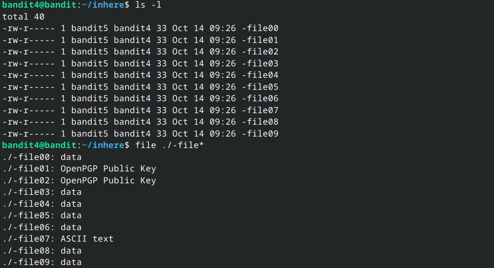

#### Level 0:
I used the following command:<br>
 `ssh bandit0@bandit.labs.overthewire.org -p 2220` 
<br>
`ssh` then complained about the unknown fingerprint of the bandit website and asked me whether I want to continue to which I responded yes. It then asked me for the password upon entering which I got a successful ssh connection to the server. I could access the password for the next level in readme file stored in the home directory which I read out using the `cat` command.
- - -
#### Level 1:
First I opened an ssh connection to the server and then I used the command `cat ./-` to display the flag in my terminal.
- - -
#### Level 2:
I used the command `cat ./'--spaces in this filename--'` to solve this level. By default the shell treats whitespace as a delimeter for commands/arguments to commands thus by using single quotes I force the shell to see the name of the file as a whole and treat it as a string with whitespaces.
- - -
#### Level 3:
First I used `ls -A ./inhere` to get the name of the hidden file which was revealed to be `...Hiding-From-You`. Then I used the command <br> `cat ./inhere/...Hiding-From-You` to read the password for level 4.
- - -
#### Level 4:

Clearly the file command revealed that only the eighth file is human readable.
- - -
#### Level 5:
I used the command `find . -size 1033c` to find the file with size of 1033 bytes. Luckily there was only one such file which contained the password for the next level .
- - -
#### Level 6:
I used the command `find . -user bandit7 -group bandit6 -size 33c` which found the file for me.
- - -
#### Level 7:
I used the command `grep "millionth" ./data.txt` .
- - -
#### Level 8:
I used the command `cat data.txt | sort | uniq -u` .The uniq command requires sorted input so I first piped the output of cat into sort and then into uniq. The -u flag makes uniq output only those lines which occur once in the file.
- - - 
#### Level 9:
I used the command `strings ./data.txt | grep "==="` which gave me the password. The strings command outputs all chunks of human readable strings in a file.
- - -
#### Level 10:
I used the command `cat ./data.txt | base64 -d` . `base64 -d` decoded the base64 strings outputted by the `cat` command.
- - -
#### Level 11:
I used cyberchef to decode the rot13 text in the file.
- - - 
#### Level 12:
I first used `xxd` to obtain the original file from the hexdump and then it was nothing but a painstaking process to decompress the file . I had to use multiple decompression/compression tools such as `bzip2`, `gzip`, `tar` etc, and after multiple rounds of decompression I was finally able to decompress the file back to its original form.
- - -
#### Level 13:
For this level I copied the private key given on the server, logged out of it, made a file in my local directory, gave the file 600 permissions and then used the command: <br> `ssh -i ./key.private bandit14@bandit.labs.overthewire.org -p 2220`. 
- - - 
#### Level 14:
I used the command `nc localhost 30000` to make the connection to localhost on port 30000 and then submitted the password of this level to it .
- - -
#### Level 15:
The following command gets the job done :
```openssl s_client -connect localhost:30001``` .
- - -
#### Level 16:
I first used nmap to scan the ports on the server by the command `nmap -p31000-32000 localhost`. Then it gave me a list of 5 ports each of which I checked manually using openssl. I was first having issues because when the openssl connection was getting established and whatever input I gave the server sent me KEY_UPDATE. To overcome this I added the -ign_eof flag to the command which in its final form was `openssl s_client -ign_eof localhost:port`. 
- - -
#### Level 17:
Command used : `diff --normal passwords.new passwords.old`
- - - 
#### Level 18:
I used the following command: `scp -P 2220 bandit18@bandit.labs.overthewire.org:/home/bandit18/readme .` which downloaded the file for me without me having to log in to the server. 
- - -
#### Level 19:
Command used : `./bandit20-do cat /etc/bandit_pass/bandit20` .
- - -
#### Level 20:
I logged in from two terminal sessions onto the bandit server. Then from one connection, I made a python script to listen on a port and send password and receive password upon a successful connection. From the second connection, I ran the setuid binary and thus I got the next level's password.